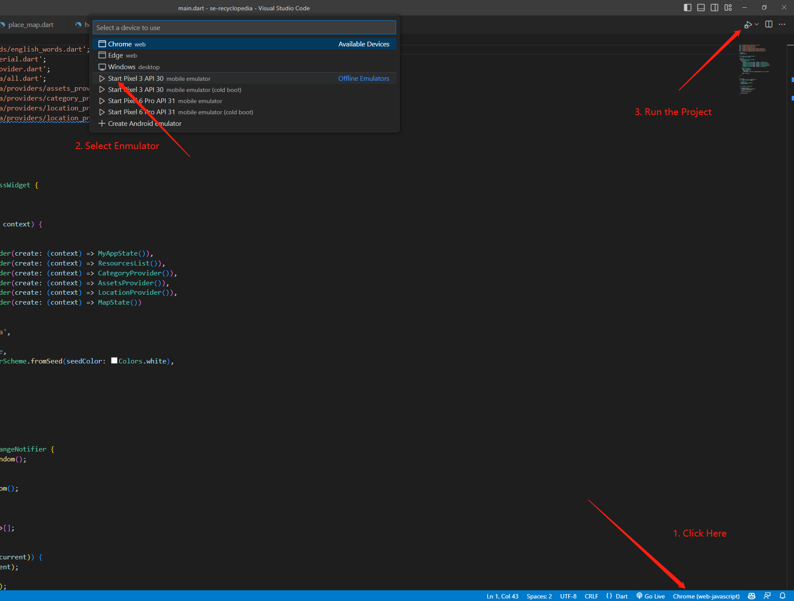

# Recyclopedia

Recyclopedia is a muti-platform mobile application that helps people to understand recycling information. 

This app is aiming to addresses the issue of 
1. Hard to locate the recycle trash bins in school  
2. Not being able to identify the categories of the trash   

 and provide solutions that promote better waste management practices in Boston University’s area.

## Table of Contents
1. [Introduction](#introduction)
2. [Technical Detail](#technical-detail)
3. [Getting Started](#getting-started)
4. [Run The Project](#run-the-project)
5. [Known bugs](#known-bugs)
6. [Risks and Limitations](#risks-and-limitations)
7. [More Information](#more-information)

## Introduction
As Boston University strives to become a more sustainable campus, we see a disconnect between the university’s Zero Waste goals and student understanding regarding what is recyclable and what is not.  The main reason for this disconnect is the lack of easily accessible resources to help students sort their waste accurately and confidently. Sustainability@BU has already incorporated the Recyclopedia Resource, which can be found on the Sustainability@BU website, into their list of resources available to students. This resource addresses that disconnect by allowing users to type in an item and telling them whether the item is recyclable or not, as well as what must be done to the item to prepare it for recycling like rinsing out a food container. 
We believe that converting the existing Recyclopedia Resource into an application for waste sorting would be a straightforward way to increase the accuracy of student recycling and help students feel more confident in the decisions they make when sorting waste.

### Flutter documentation
For help getting started with Flutter development, view the
[online documentation](https://docs.flutter.dev/), which offers tutorials,
samples, guidance on mobile development, and a full API reference.

## Technical Detail


### Flutter project folder
>contains API docs and file structure
Additional technical structure in side [this]((src/recyclopedia)) folder.

### Dataflow
>explains the dataflow

[lib/providers](lib/providers) get data from Strapi API

components gets data from and listens to providers for data updates

### Json serialization
[JSON and serialization](https://docs.flutter.dev/data-and-backend/json)

## Getting Started

### Environment Setup
#### prerequisites
Flutter 3.7.3 [installation guide](https://docs.flutter.dev/get-started/install)

After the installation, run the following command in terminal/powershell  
```bash
cd src/recyclopedia/
# install dependencies
flutter pub get
# update json_serializable autogenerated code
flutter pub run build_runner build --delete-conflicting-outputs
# check below for how to add google map api key, it is necessary for the project to function properly.
```

### Running on different Local Simulators
**Important: To run this project, you will need an API key.**

Get an API key at <https://cloud.google.com/maps-platform/>.

You might want to put the key in an `.env` file, and exclude it from version control, then refer the key by the environment variable in different platform's code. 
Checkout [this](https://stackoverflow.com/questions/57587190/load-api-key-to-androidmanifest-xml-from-env-file-in-flutter) link.

#### Android
first run
```
flutter create --platforms android .
```
it will create a platform specific code for running the project locally. 

>**The folder created is excluded from version control**

Specify your API key in the application manifest inside the generated folder, relative path:
`android/app/src/main/AndroidManifest.xml`:

```xml
<manifest ...
  <application ...
    <meta-data android:name="com.google.android.geo.API_KEY"
               android:value="@string/<Your environment variable for the key>"/>
```

#### iOS
first run
```
flutter create --platforms ios .
```
it will create a platform specific code for running the project locally. 

>**The folder created is excluded from version control**

Add `import GoogleMaps` on the top in `AppDelegate.swift`;   
Specify your API key in `AppDelegate.swift`:

```swift
@UIApplicationMain
@objc class AppDelegate: FlutterAppDelegate {
  override func application(
    _ application: UIApplication,
    didFinishLaunchingWithOptions launchOptions: [UIApplication.LaunchOptionsKey: Any]?
  ) -> Bool {
    GMSServices.provideAPIKey("YOUR API KEY HERE")
    GeneratedPluginRegistrant.register(with: self)
    return super.application(application, didFinishLaunchingWithOptions: launchOptions)
  }
}
```

#### Web
first run
```
flutter create --platforms web .
```
it will create a platform specific code for running the project locally. 

>**The folder created is excluded from version control**

Add your API key to `web/index.html` in the `<head>` tag:

```
<script src="https://maps.googleapis.com/maps/api/js?key=<YOUR_API_KEY_HERE>"></script>
```

For additional help setting up the plugin, see the plugin's
[README](https://pub.dev/packages/google_maps_flutter)
page.

## Run The Project

First, make sure the environment is set up as instructed from the getting started section. 
To be more specific, make sure that the dianostic from **Flutter Doctor** are resolved properly. 

Then run:
```
flutter run
```

### Running Project Using VSCode

1. Make sure the vscode extension for [Dart](https://marketplace.visualstudio.com/items?itemName=Dart-Code.dart-code) and [Flutter](https://marketplace.visualstudio.com/items?itemName=Dart-Code.flutter) is installed. 


2. Direct to the root directory (if you have not already done so) of the project by running  
`cd src/recyclopedia`

3. Select your environment to run. e.g. If you want to use Android phone to run the project, select an Android phone enmulator. 

4. Click on the top-right trangle to start.



### Running Project Using Android Studio

1. Direct to the root directory (if you have not already done so) of the project by running  
`cd src/recyclopedia`

2. Add configeration if you haven't done so.


3. Select your environment to run. e.g. If you want to use Android phone to run the project, select an Android phone enmulator. 


4. Click on the top-right trangle to start.


## Deployment Plan
### Deploying to Google Play Store
Follow [this](https://appinventiv.com/blog/how-to-submit-app-to-google-play-store/) link.
First, make a .apk file of the project. Follow [this](https://code.tutsplus.com/tutorials/how-to-generate-apk-and-signed-apk-files-in-android-studio--cms-37927) link.
1. Google Play Developer Console   
2. Link Developer Account with Google Wallet Merchant Account   
3. Create Application   
4. App Store Listing   
5. Upload App Bundles or APK To Google Play   
6. Time For Content Rating     
7. Fix App Pricing and Distribution   
8. Publish the Application

### Deploying to Apple App Store

Following [this](https://developer.apple.com/ios/submit/) link.  


## Known bugs
1. On the navigation rail, quickly switching between the map section and other sections may cause a bug
2. After selecting an trash item, there is a "find bin" button at the bottom of the screen. Clicking that button will redirect the user to the map page, but there is no backward button or navigation rail if the map page is reached in such a way, meaning the user is stuck on the map page.
3. On the home page, for alphabetical categorizing the trash items. Sections will take at least two rows of space even if there are at most one row of contents to display, resulting in extra spaces between sections.
4. When navigating from map marker to place details, before switch place category, we are able to navigate to tap on map for navigation; however, after switch category, we are not able to do so.

## Risks and Limitations
>This section identifies foreseeable harms and misunderstandings...

This app should not be used to locate the user, it currently lacks the ability to access the location of the user while using the app.

This app is currently in beta, contents displayed are solely for testing purposes. Please regard with caution.

## More Information
More about his project, contact [BU sustainbility](https://www.bu.edu/sustainability/) or [BU Spark!](https://www.bu.edu/spark/)

### Add Users
To add yourself to the repository, open a Pull Request modifying `COLLABORATORS`, entering your GitHub username in a newline.

All Pull Requests must follow the Pull Request Template, with a title formatted like such `[Project Name]: <Descriptive Title>`

### 🚀 Getting started with Strapi

Strapi comes with a full featured [Command Line Interface](https://docs.strapi.io/developer-docs/latest/developer-resources/cli/CLI.html) (CLI) which lets you scaffold and manage your project in seconds.


### Strapi Setup Information
```
npm run build 

```

```
ENV_PATH=./.env.production NODE_ENV=producti npm run develop

```

### To add/edit content-type: 
1. Clone this repo and cd into strapi-se folder
2. Follow following command: 
```
npm run build 

```

```
ENV_PATH=./.env.production NODE_ENV=producti npm run develop

```
3. Going to "http://0.0.0.0:1337/admin" to add/edit content type
